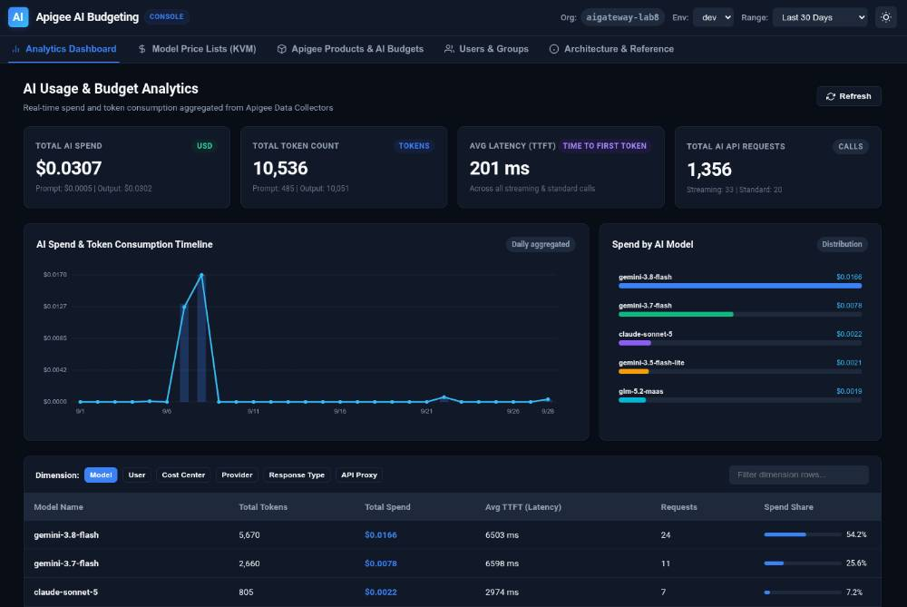

# Apigee AI Model Budgeting & Analytics Console

A minimalist, modern management and analytics console for Apigee AI Gateways. It enables enterprise API teams to maintain model pricing, seamlessly configure Apigee API Products with token or dollar budgets (with automatic bidirectional conversion), and monitor real-time AI usage and spend across models, users, cost centers, and providers using Apigee Analytics.

> 🚀 **Live Dashboard**: [https://apigee-ai-budgeting-725632883020.europe-west1.run.app](https://apigee-ai-budgeting-725632883020.europe-west1.run.app)

[](https://apigee-ai-budgeting-725632883020.europe-west1.run.app)

---

## Key Features

1. **AI Model Price List Management (`AI-Config.PriceList`)**:
   - Stores and synchronizes pricing per million tokens across any or all Apigee environments.
   - Granular pricing per model for:
     - Input Prompt Tokens (`requestPerMillionTokens`)
     - Output Response Tokens (`responsePerMillionTokens`)
     - Cached Tokens (`cachedRequestPerMillionTokens`)
     - Default fallback pricing (`default`)
   - **Load List Price Defaults**: 1-click loading of standard model pricing into KVM `AI-Config.PriceList` (including `gemini-3.5-flash-lite`, `gemini-3.8-flash`, `claude-sonnet-5`, `claude-opus-5-5`, etc.).
   - Interactive rate editor, raw JSON viewer/editor, and quick cost estimator.

2. **Apigee Products & Bidirectional Budgeting**:
   - Inspects existing Apigee API Products and identifies AI-enabled products using native `llmOperationGroup`.
   - **Bidirectional Token / Money Conversion**: Manage model quotas in **Money ($ USD)** or **Tokens**. Modifying the dollar amount dynamically converts to token limits based on the active environment's price list, and vice-versa.
   - Configure quotas with custom limits, intervals (`1`, `5`, `15`...), and time units (`minute`, `hour`, `day`, `month`).
   - Easily deploy product changes across selected Apigee environments.
   - Wizard to scaffold new AI API Products.

3. **Analytics Dashboard with Native AI Data Collectors**:
   - Real-time spend ($ USD) and token tracking aggregated directly from Apigee BigQuery Analytics.
   - Visual trend line of daily spend and token volume over customizable time ranges (24h, 7d, 30d, all).
   - Proportional distribution of spend across AI models.
   - Granular breakdown table supporting grouping and filtering by:
     - `dc_ai_model` (e.g. `gemini-1.5-pro`, `claude-sonnet-5`, `glm-5.2-maas`)
     - `dc_ai_user` (user ID or email)
     - `dc_ai_cost_center` (department or organizational unit)
     - `dc_ai_provider` (Google, Anthropic, OpenAI, etc.)
     - `dc_ai_response_type` (`streaming` vs `non-streaming`)
     - `apiproxy` and `developer_app`

4. **Users & Groups Management with Cost Correlation**:
   - Directory of Apigee users and developer groups enriched with real-time AI spend ($ USD), token consumption, and API call volumes.
   - Comprehensive app and credential management:
     - Register and delete developer client applications.
     - Generate, inspect, and revoke API credential keys (with masked secret toggling and 1-click clipboard copy).
     - Assign and update credential subscriptions across Apigee API products (with automatic AI-tier badges).
   - Multi-tier analytics attribution:
     - **Developer level**: aggregated spend and tokens across `developer_email` and `dc_ai_user`.
     - **App level**: aggregated spend and tokens across `developer_app`.
     - **Credential level**: granular spend and tokens correlated via `client_id`.

5. **Zero-Dependency Minimalist UI**:
   - Native HTML5, CSS3, and JavaScript in `./public` (no node_modules, npm build step, or external CDN dependencies).
   - Native dark mode and light mode switching with `color-scheme` support and local storage persistence.
   - Responsive native `<dialog closedby="any">` modals with click-outside dismiss.
   - Canvas-rendered charts for maximum performance and offline reliability.

---

## Price List JSON Format

Stored in the environment KeyValueMap `AI-Config` under key `PriceList`:

```json
{
  "default": {
    "requestPerMillionTokens": 1.0,
    "responsePerMillionTokens": 3.0,
    "cachedRequestPerMillionTokens": 0.25
  },
  "gemini-3.5-flash-lite": {
    "requestPerMillionTokens": 0.05,
    "responsePerMillionTokens": 0.20,
    "cachedRequestPerMillionTokens": 0.0125
  },
  "gemini-3.8-flash": {
    "requestPerMillionTokens": 0.15,
    "responsePerMillionTokens": 0.60,
    "cachedRequestPerMillionTokens": 0.0375
  },
  "claude-sonnet-5": {
    "requestPerMillionTokens": 3.0,
    "responsePerMillionTokens": 15.0,
    "cachedRequestPerMillionTokens": 0.30
  },
  "claude-opus-5-5": {
    "requestPerMillionTokens": 15.0,
    "responsePerMillionTokens": 75.0,
    "cachedRequestPerMillionTokens": 1.50
  }
}
```

---

## Supported Apigee Data Collectors

The console queries and aggregates the following standard Apigee data collectors:

| Data Collector | Type | Description |
| :--- | :--- | :--- |
| `dc_ai_model` | `STRING` | AI model requested (e.g., `gemini-1.5-pro`) |
| `dc_ai_user` | `STRING` | User ID or email consuming the model |
| `dc_ai_provider` | `STRING` | Provider of the model (Google, Anthropic, etc.) |
| `dc_ai_cost_center` | `STRING` | Cost center / department of the user |
| `dc_ai_total_token_count` | `INTEGER` | Total token count (request + response) |
| `dc_ai_prompt_token_count` | `INTEGER` | Input prompt token count |
| `dc_ai_response_token_count` | `INTEGER` | Output generated response token count |
| `dc_ai_response_type` | `STRING` | `streaming` or `non-streaming` |
| `dc_ai_time_first_token` | `INTEGER` | Time in ms to the first token response (TTFT) |
| `dc_ai_request_cost` | `FLOAT` | Cost of input prompt tokens in USD |
| `dc_ai_response_cost` | `FLOAT` | Cost of generated response tokens in USD |
| `dc_ai_total_cost` | `FLOAT` | Total cost of the call in USD |

---

## Local Development

### Prerequisites
- Go 1.22+
- `gcloud` CLI authenticated with an account having access to your Apigee organization:
  ```bash
  gcloud auth login
  gcloud config set project <YOUR_PROJECT_ID>
  ```

### Run Locally
```bash
# Using build.sh (defaults to port 8080)
./build.sh run

# Run on a custom port
PORT=9090 ./build.sh run

# Or directly with Go
PORT=9090 go run .
```

Open `http://localhost:8080` in your browser.

---

## Deploy to Cloud Run

The application is container-ready with a multi-stage Dockerfile and uses Application Default Credentials (ADC).

```bash
# Set your project ID
export GOOGLE_CLOUD_PROJECT="my-apigee-project"
export REGION="us-central1"

# Deploy using build.sh
./build.sh deploy

# Or deploy manually with gcloud
gcloud run deploy apigee-ai-budgeting \
  --source . \
  --region $REGION \
  --platform managed \
  --allow-unauthenticated \
  --set-env-vars "GOOGLE_CLOUD_PROJECT=$GOOGLE_CLOUD_PROJECT"
```

### Cloud Run IAM Permissions
Ensure the Cloud Run service account has the following IAM roles on the GCP project:
- **Apigee Read-Only Admin** or **Apigee API Admin** (`roles/apigee.admin`)
- **Apigee Analytics Agent** (`roles/apigee.analyticsAgent`)

---

## Proxy Integration Example

To record costs in Apigee proxies using the KVM price list, add a JavaScript policy in your proxy's target postflow:

```javascript
// Fetch PriceList from KVM
var priceListJson = context.getVariable("kvm.AI-Config.PriceList");
var prices = JSON.parse(priceListJson || "{}");

var model = context.getVariable("ai.model") || "default";
var modelPricing = prices[model] || prices["default"] || {
  requestPerMillionTokens: 1.0,
  responsePerMillionTokens: 3.0
};

var promptTokens = parseInt(context.getVariable("ai.promptTokenCount") || "0", 10);
var responseTokens = parseInt(context.getVariable("ai.responseTokenCount") || "0", 10);

var reqCost = (promptTokens / 1000000.0) * modelPricing.requestPerMillionTokens;
var respCost = (responseTokens / 1000000.0) * modelPricing.responsePerMillionTokens;
var totalCost = reqCost + respCost;

context.setVariable("ai.requestCost", reqCost.toFixed(6));
context.setVariable("ai.responseCost", respCost.toFixed(6));
context.setVariable("ai.totalCost", totalCost.toFixed(6));
```

Followed by a `DataCapture` policy collecting `ai.requestCost`, `ai.responseCost`, and `ai.totalCost` into `dc_ai_request_cost`, `dc_ai_response_cost`, and `dc_ai_total_cost`.
